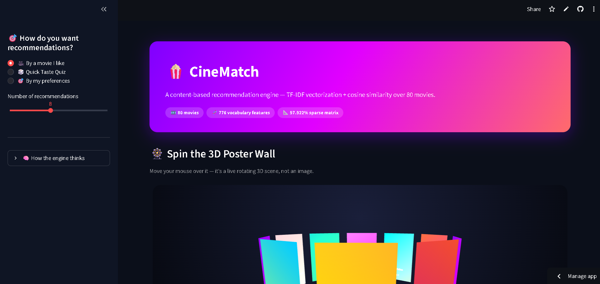
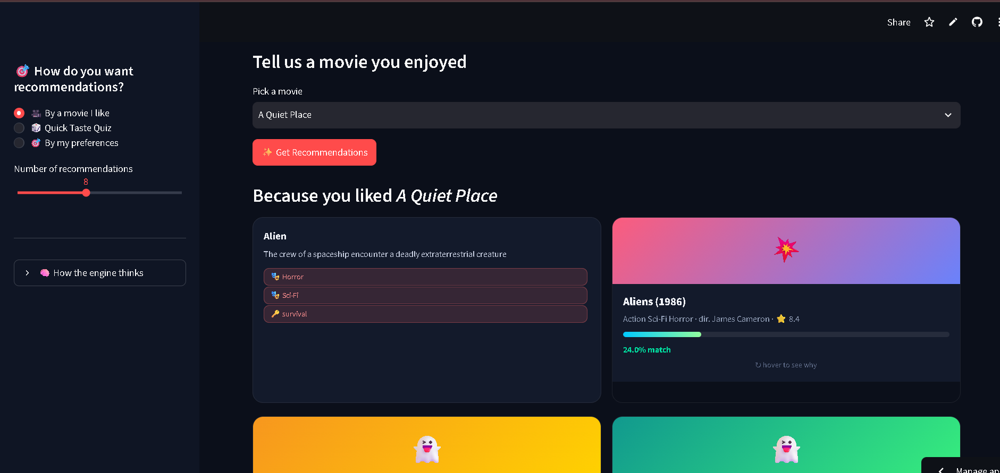
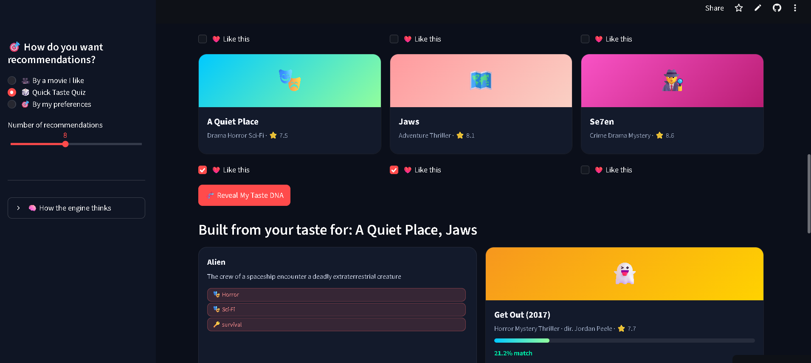
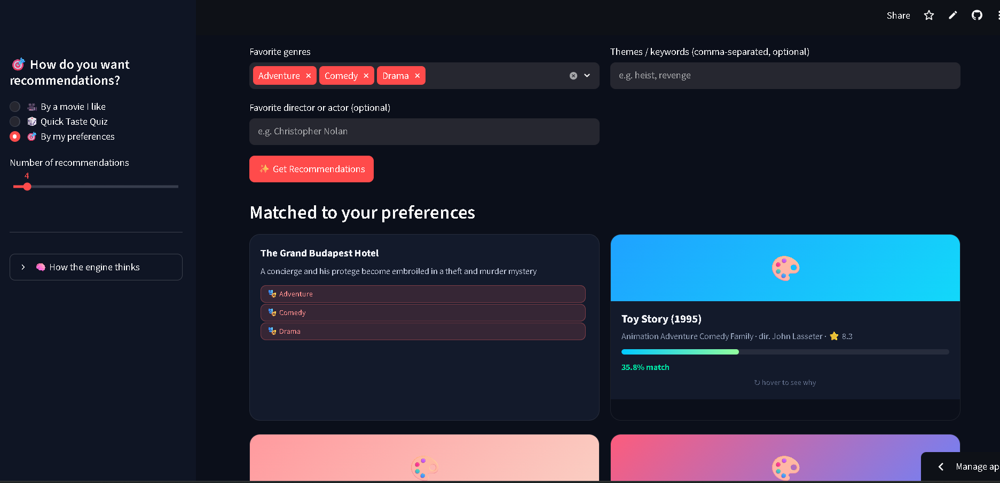

# 🎬 CineMatch — Content-Based Movie Recommendation Engine

A movie recommender built with **pandas, numpy, scikit-learn (TF-IDF + cosine similarity)**
and deployed as an interactive **Streamlit** app.

## 🌐 Live Demo
**Try the application here:**
🔗 https://movie-recommenation-system-3wwklx8pekygjmvwcjpdgp.streamlit.app

## 📸 Screenshots

| 🏠 Home Page | 🎬 Movie Recommendations |
|--------------|--------------------------|
|  |  |
| 🧩 Quick Taste Quiz | 🎯 Preference-Based Recommendations |
|---------------------|-------------------------------------|
|  |  |

## How it works

1. Each movie's **genres, director, cast, keywords, and overview** are combined into one
   text "profile" (`recommender.py → _load_data`). Genres/director/cast are weighted more
   heavily since they're stronger similarity signals than free-text overviews.
2. `TfidfVectorizer` (scikit-learn) turns every movie's profile into a numeric vector.
3. `cosine_similarity` compares vectors to find movies that point in the same "direction"
   in feature space — i.e. movies that are thematically/stylistically similar.
4. Three recommendation modes are exposed in the app:
   - **By a movie I like** — classic "because you watched X" recommendations.
   - **By multiple favorites** — averages the TF-IDF vectors of several liked movies into
     one taste profile, then finds the closest matches.
   - **By my preferences** — builds a synthetic profile from selected genres, a favorite
     director/actor, and free-text keywords (no need to have watched anything).

## Project structure

```
movie_recommender/
├── app.py              # Streamlit UI
├── recommender.py       # Core recommendation engine (reusable, no Streamlit dependency)
├── data/
│   └── movies.csv        # Sample dataset (80 movies with genre/cast/director/keywords)
├── requirements.txt
└── README.md
```

## Run it locally

```bash
cd movie_recommender
pip install -r requirements.txt
streamlit run app.py
```

Then open the URL Streamlit prints (usually `http://localhost:8501`).

## Use your own dataset

Swap in a bigger dataset (e.g. the MovieLens or TMDB 5000 datasets) — just make sure your
CSV has these columns, then point `MovieRecommender("data/movies.csv")` at the new file:

| column | description |
|---|---|
| `title` | movie title |
| `year` | release year |
| `genres` | space-separated genres, e.g. `Action Sci-Fi` |
| `director` | director name |
| `cast` | space-separated lead actor names |
| `keywords` | space-separated theme/plot keywords |
| `overview` | short plot summary |
| `rating` | numeric rating (for display only) |

With a larger dataset (10k+ movies), consider replacing the fully-precomputed
`cosine_similarity` matrix in `recommender.py` with `sklearn.neighbors.NearestNeighbors`
(fit on the TF-IDF matrix) so you're not holding an N×N matrix in memory.

## Deploying

### Option A — Streamlit Community Cloud (free, easiest)
1. Push this folder to a public GitHub repo.
2. Go to [share.streamlit.io](https://share.streamlit.io), sign in with GitHub.
3. Click **New app**, select the repo/branch, and set the main file path to `app.py`.
4. Deploy — Streamlit installs `requirements.txt` automatically and gives you a public URL.

### Option B — Docker (any cloud provider)
```dockerfile
FROM python:3.11-slim
WORKDIR /app
COPY . .
RUN pip install --no-cache-dir -r requirements.txt
EXPOSE 8501
CMD ["streamlit", "run", "app.py", "--server.port=8501", "--server.address=0.0.0.0"]
```
Build and run:
```bash
docker build -t cinematch .
docker run -p 8501:8501 cinematch
```
Push the image to any container host (Render, Railway, Fly.io, AWS ECS/App Runner, GCP Cloud Run).

### Option C — Render / Railway (no Docker needed)
Both platforms support Python web services directly: set the start command to
```
streamlit run app.py --server.port=$PORT --server.address=0.0.0.0
```

## Extending this project
- **Collaborative filtering**: add a `ratings.csv` (user_id, movie_id, rating) and build a
  user-item matrix + matrix factorization (SVD via `scipy.sparse.linalg.svds` or
  `surprise`/`implicit` libraries) for "users like you also liked" recommendations.
- **Hybrid model**: blend the content-based similarity score with a popularity/rating
  score, e.g. `final_score = 0.8*similarity + 0.2*normalized_rating`.
- **Posters/images**: hit the free TMDB API with each movie title to pull a poster URL
  and display it in the card.
- **Persistence**: cache the TF-IDF matrix and similarity matrix to disk with `pickle` or
  `joblib` so large datasets don't get re-vectorized on every app restart.
